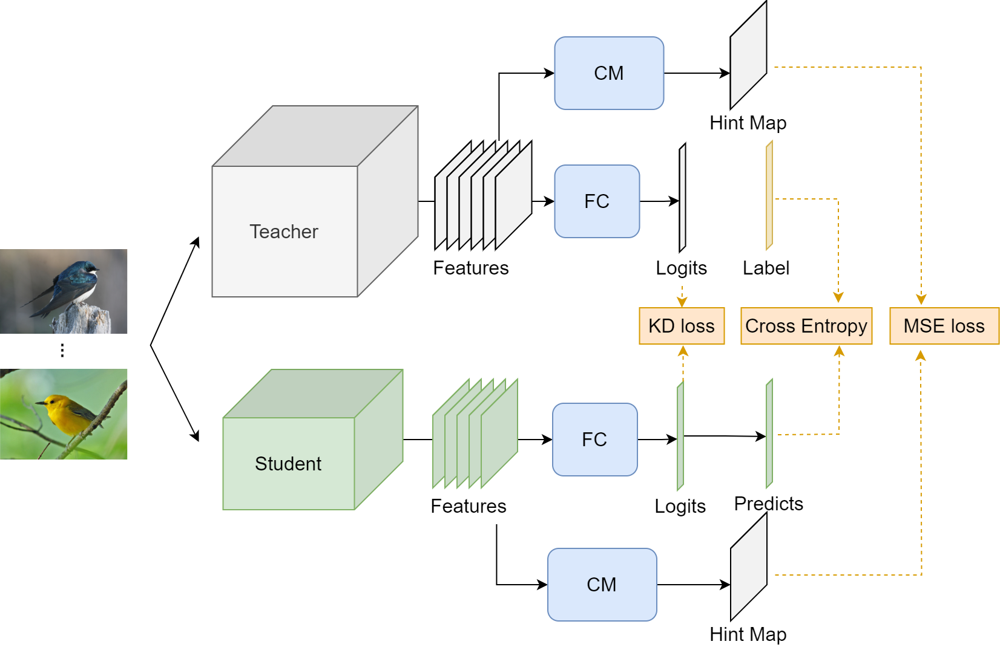

# FGVC_CTRLS_CAM
paper url : https://ieeexplore.ieee.org/document/10444242

In this paper, we focus on knowledge distillation specifically designed for fine-grained image recognition. Notably, this strategy is inspired by the Class Activation Maps (CAM). We first train a complex model and use it generated feature maps with spatial information, which is call hint maps. Furthermore, we propose an adjustment strategy for this hint map, which can control local distribution of information. Referring to it as Controllable Size CAM (CTRLS-CAM). Use it as a guide allowing the student model to effectively learn from the teacher model’s behavior and concentrate on discriminate details. In contrast to conventional distillation models, this strategy proves particularly advantageous for fine-grained recognition, enhancing learning outcomes and enabling the student model to achieve superior performance. In CTRLS-CAM method, we refine the hint maps value distribution, redefining the relative relationships between primary and secondary feature areas. We conducted experiments using the CUB200-2011 dataset, and our results demonstrated a significant accuracy improvement of about 5% compared to the original non-distilled student model. Moreover, our approach achieved a 1.23% enhancement over traditional knowledge distillation methods.



in this implementation
also ditillation on other FGVC datasets, including cub200, nabird, stancar, standog, aircraft.

accuracy table
!!!!!!!!!!
1. Sysyem
   - CPU： Intel(R) Core(TM) i9-9900K CPU @ 3.60GHz
   - GPU：NVIDIA GeForce RTX 2080 Ti 
   - GPU Driver：525.78.01
   - Operate System (OS)：Ubuntu 20.04.5 LTS
   - CUDA Version：release 11.3, V11.3.58
   - CuDNN Version：8.7.0
   - Python：3.8.0
   - Pytorch：2.2.1+cu121
2. Environment
   Anaconda recommend!
   ```
   pip install wandb
   pip install tqdm
   ```
3. Data Preparation

4. Training Teacher & Student model

5. Distillation
   ```
   python main.py --c cfg_setting.yaml
   ```
